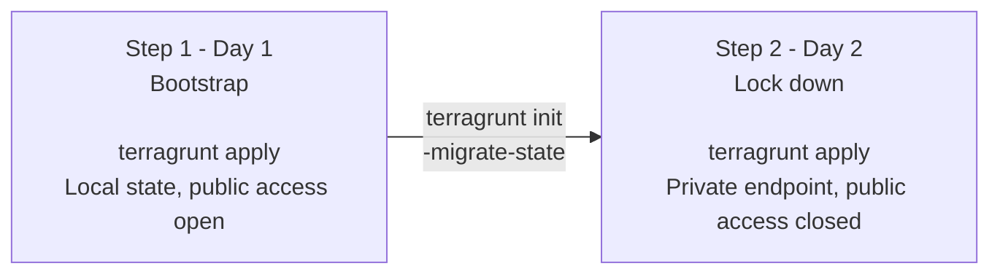

# 01bootstrap

Creates the Terraform remote-state storage account and the Entra ID group
used to access it. This has to exist before anything else in this repo can
use a remote backend, which is why it's bootstrapped on its own.

Module: [modules/bootstrap](../modules/bootstrap).

## Layout

```
01bootstrap/
  root.hcl          # shared: points every environment at modules/bootstrap
  prd/
    env.hcl          # subscription_id, names, tags, UPNs, Day 2 flags
    terragrunt.hcl    # include root, provider + backend config, inputs = env locals
```

One folder per environment, each fully independent: its own subscription,
resource group, storage account, and state. To add a new environment, copy
`prd/` to a new folder and fill in its `env.hcl`.

## What it creates

- A resource group, locked against deletion (`create_resource_group = true`
  by default; set it to `false` to use one that already exists)
- A storage account with no shared keys, Azure AD-only access, TLS 1.2,
  double encryption at rest, versioning + soft delete, and its own
  delete lock
- The blob containers listed in `container_names`
- An Entra ID group (`create_group = true` by default; set to `false` to
  look up one that already exists instead), granted `Storage Blob Data
  Contributor` on the storage account

Naming follows a short fixed pattern (`01saeusprdalaitfstate`, etc.) -
see the [root README](../README.md#naming-convention) for what each part
means.

## Prerequisites

- `terraform`, `terragrunt`, and the `az` CLI installed
- `az login`, with an account that can create resource groups, storage
  accounts, and Entra ID groups in the target subscription
- `env.hcl` filled in for the environment you're bootstrapping - at least
  `subscription_id` and a globally-unique `storage_account_name`

## Bootstrap: Day 1 and Day 2

The storage account can't start out in the remote backend it's meant to
hold state for - that backend doesn't exist yet. So it's rolled out in two
steps: bootstrap first with local state, then migrate.



### Step 1 - Day 1: bootstrap

`terragrunt.hcl` ships with two `remote_state` blocks: a `local` one and an
`azurerm` one, with only one active at a time. For a brand-new environment,
make sure the `local` block is active and the `azurerm` block is commented
out, then:

```bash
cd 01bootstrap/<env>
terragrunt init
terragrunt apply
```

This creates the resource group, storage account, containers, and Entra ID
group listed above, with `enable_private_endpoint` and `enable_diagnostics`
left at `false` so the account stays reachable over the public endpoint.
State is written locally to `01bootstrap/<env>/terraform.tfstate`
(gitignored - never commit it).

### Migrate state to the remote backend

Do this before Day 2. Once the private endpoint closes public network
access, only something with private network connectivity can reach the
account - including Terraform itself. If state is still local at that
point, you're locked out of it.

1. In `<env>/terragrunt.hcl`, comment out the `local` block and uncomment
   the `azurerm` block:
   ```hcl
   remote_state {
     backend = "azurerm"
     generate = {
       path      = "backend.tf"
       if_exists = "overwrite_terragrunt"
     }
     config = {
       resource_group_name  = local.env.locals.resource_group_name
       storage_account_name = local.env.locals.storage_account_name
       container_name       = local.env.locals.container_names[0]
       key                  = "01bootstrap/<env>/terraform.tfstate"
       use_azuread_auth     = true
       subscription_id      = local.env.locals.subscription_id
     }
   }
   ```
2. Run the migration and confirm **yes** when asked to copy existing state:
   ```bash
   terragrunt init -migrate-state
   ```
3. `terragrunt plan` should show `No changes.` If it doesn't, stop and
   investigate before going further.

No resources are touched by this step - only where the state lives
changes. See `prd/terragrunt.hcl` for a working reference.

### Step 2 - Day 2: lock down

Requires an existing subnet and an existing
`privatelink.blob.core.windows.net` DNS zone already linked to that VNet.

In `<env>/env.hcl`:

```hcl
enable_private_endpoint    = true
private_endpoint_subnet_id = "<existing subnet resource ID>"
private_dns_zone_id        = "<existing private DNS zone resource ID>"
```

```bash
terragrunt apply
```

Same resource, same state - the network rules and public access setting
flip in place (not a recreation), and the private endpoint + DNS zone
group are added.

### Optional: diagnostics

Requires an existing Log Analytics workspace.

```hcl
enable_diagnostics         = true
log_analytics_workspace_id = "<existing Log Analytics workspace resource ID>"
```

```bash
terragrunt apply
```

Sends `StorageRead`/`StorageWrite`/`StorageDelete` logs and transaction
metrics to the workspace.

### Rollback

Set `enable_private_endpoint` (and/or `enable_diagnostics`) back to
`false` and re-apply. Public access reopens, and the private endpoint /
diagnostic setting are destroyed - the storage account and its data are
untouched throughout.

## Outputs

| Output | Value |
|---|---|
| `resource_group_name` | Name of the resource group |
| `storage_account_name` | Name of the storage account |
| `storage_account_id` | Resource ID of the storage account |
| `private_endpoint_id` | Resource ID of the private endpoint, or `null` on Day 1 |
| `group_object_id` | Object ID of the Entra ID group |
