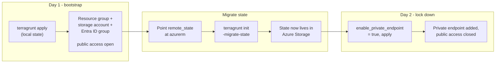

# azure-databricks-infrastructure

Terragrunt + Terraform for Azure Databricks environments, with a network
boundary that keeps data exfiltration paths closed off by default.

## Layout

- `01bootstrap/` - creates the Terraform remote-state storage account and
  the Entra ID group used for access to it. Everything else builds on top
  of this.
- `modules/bootstrap/` — the Terraform module `01bootstrap` calls.

## Bootstrap: Day 1 and Day 2

The bootstrap storage account can't start in the remote backend it's meant
to hold state for - it doesn't exist yet. So it's a two-step rollout:



**Do the state migration before Day 2.** Once the private endpoint closes
public network access, only something with private network connectivity
can reach the account - including Terraform itself. If state is still
local at that point, you're locked out of it.

```bash
cd 01bootstrap/<env>
terragrunt apply              # Day 1: local state, public access

# edit terragrunt.hcl: remote_state backend -> azurerm
terragrunt init -migrate-state   # move state into the storage account

# edit env.hcl: enable_private_endpoint = true
terragrunt apply              # Day 2: private endpoint, public access closed
```

## Naming convention

Names in this repo (`01bootstrap/prd/env.hcl`) follow a short, fixed
pattern so resource names stay predictable and fit Azure's length limits.
`alpha-ai` is just the example project used in this repo - swap it, the
region, and the environment for your own when you reuse this module.

| Token | Meaning |
|---|---|
| `alpha-ai` | Project name - example project used in this repo, rename to yours |
| `alai` | Project name, shortened - storage account names can't have hyphens and are capped at 24 characters, so `alpha-ai` becomes `alai` there |
| `eus` | Region, shortened - East US (`location = "eastus"`) |
| `prd` | Environment - production |
| `01` | Sequence number - first instance of this resource |

Put together: `01saeusprdalaitfstate` reads as *storage account #1, East US,
production, alpha-ai, terraform state*.
